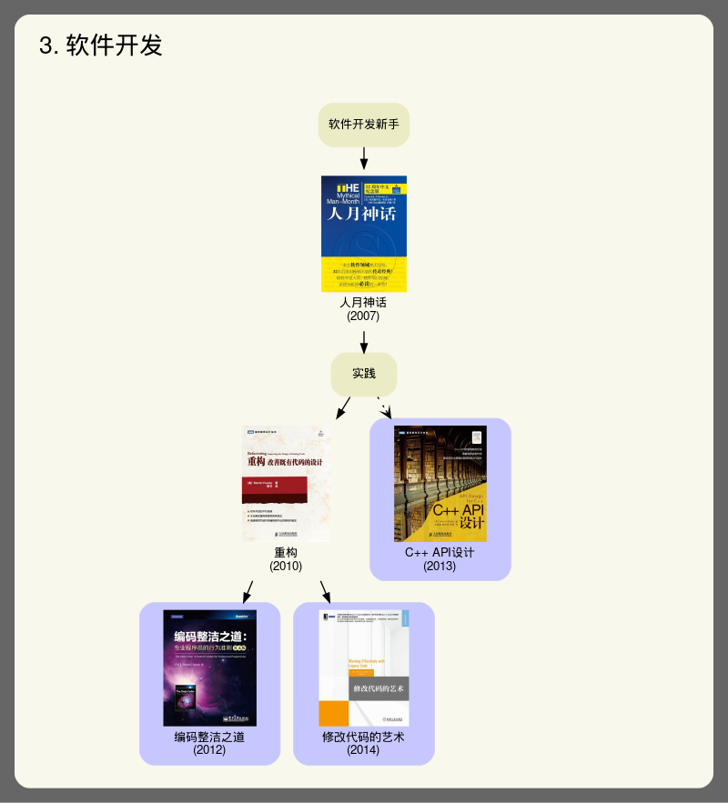
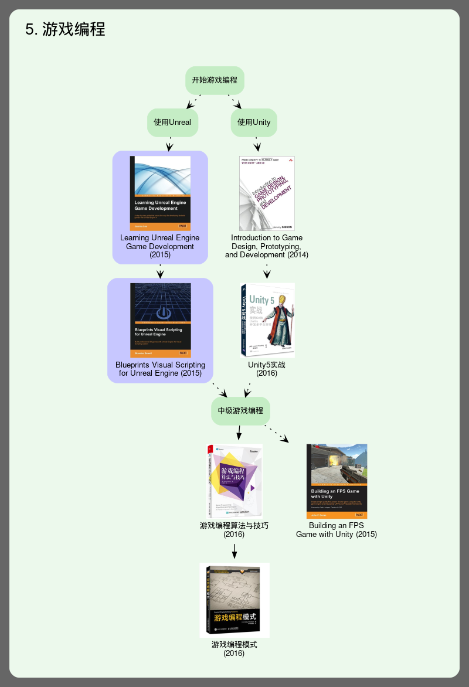

# 游戏程序员之路

大部分人并没有Milo的经历，精力和能力有限，因此裁剪一下自己的游戏程序员之路。

展示我已经阅读过的书，以及将要阅读的书。

## 资源链接

[下载1](http://wiki.cgt3d.cn/mediawiki/index.php/%E6%B8%B8%E6%88%8F%E7%A8%8B%E5%BA%8F%E5%91%98%E7%9A%84%E5%AD%A6%E4%B9%A0%E4%B9%8B%E8%B7%AF)

[下载2](https://github.com/kurong00/GameProgramBooks)

## 构建

编辑dot文件，Linux上构建，然后把图片文件下载回来提交

安装：graphviz

构建：`make`

### 在Windows上构建的问题

试了一下，主要是不稳定，缺字体，懒得维护了

## 开发指南

工具：Pycharm Remote Deployment

* Pycharm将本地代码上传到Linux服务器
* 编辑dot文件，自动上传
* 远程make
* Pycharm的Remote Host窗口直接查看png文件，可以与原版图片对比

## 我的游戏程序员之路

默认是我看过的书，自认为已经掌握核心概念，但是也不敢说100%细节都知道，大部分有待实践。

对于CSAPP这种大部书，只能说常读常新，也不要求完全掌握，因为不是所有的章节游戏开发都需要熟悉。

蓝色框的是我将要看的书。

可以看到学习是一个搜索的过程，制定了roadmap之后，我们**总是在边界上进行探索，降低学习曲线**。

这种方法比列一个巨长的清单要好得多。

额外补充一些书籍和项目，这些都是自己阅读过的。

## 计算机科学

* CSAPP，计算机体系结构，CPU架构和缓存优化
  * 先从代码层面优化入手，之后深入硬件
* CAAQA，并行计算架构，服务端和GPU都有用
* 操作系统
  * 多线程编程需要
  * 熟悉Linux日常开发概念
* 算法
  * 不专精纯算法，高级数据结构
  * 基本内容要了解，满足日常开发
  * 熟悉某一种STL实现，folly，Lua的字符串和表实现
  * 熟悉各种游戏相关算法，在后面具体讨论
* 数学，游戏有专门的数学，后面讨论，而这里的离散数学和计算数学离实际应用太远了

## 程序语言

程序语言是程序员第一级别的工具，也是trust base

相比于程序语言，游戏功能，界面，编辑器都是建立在程序基础之上的，功能和需求变化大，而且会有BUG

游戏开发中，程序语言分为两种，脚本语言和引擎语言C++

脚本语言随引擎和项目学习使用即可，C++则是重点，和需要长期学习的

程序语言的应用分两个层面，一是使用，二是编译器/解释器开发

以C#为例，《深入理解C#》就是使用层面，用C#来开发程序；《CLR via C#》就是编译器层面，去了解C#的运行时实现细节

脚本语言接入引擎需要编译器开发技能，这也是一块大工程，需要持续跟进优化

C++的坑很深，不打算深入了解编译器和模板黑魔法，以日常开发为目标学习，能维持ZeloEngine开发即可

## Lua补充

* 《Lua设计与实现》
* 《自己动手实现Lua》
* ZeloLua，我的Lua实现，包含一些论文和参考
* xLua，腾讯的Unity Lua热更方案

## 软件工程

软件工程是很重要的，主要是解决如何维护长达2~3年以上生命周期的代码库

好的软件架构，能够维持很长的生命周期，易于扩展功能；再不济就是需要重构，再不行已经崩了就只能重写了

对于单个程序员，软件工程有一个问题，就是太虚了，无法量化，快速实践和反馈

相关书籍都很有名，《人月神话》，《重构》

看是要看的，但是无法直接对应输出，在此不列书单

倾向于以实践为主，也就是自己去写足够大的程序，比如把项目代码维护好，比如写ZeloEngine

有几个点：
* 设计模式
  * 我的理解，语言是最高级的设计模式，语言本身的设计对传统意义的“设计模式”影响非常大，Peter Norvig有一篇文章可以看下
  * 然后是框架是第二层设计模式，在这一层，事件系统（观察者模式）等都已被封装
  * 然后才是传统的设计模式，也就是日常开发中会用到的惯用写法
* UML
  * 严格的UML那一套效率很低，规则很繁琐
  * 但是UML是一种程序设计工具，在需求和实现分析阶段非常重要，流程图，时序图，状态图是常用的
  * 实际日常开发中，会因为需求变化太快，需求质量低而不值得做UML，但是这个技能是需要掌握的
* 重构
  * 非常吃实践，基本做法是划定一个足够小的范围，然后重构以达到代码质量提升的目标
* 代码规范
  * 保持统一
* 最佳实践
  * 平时积累

## 游戏逻辑

没有固定路线，以做游戏为主

下面这两部书作为补充，时间长了，基本所有内容都会覆盖到，不必一开始捧着书读完再去写代码
* 游戏编程算法技巧
* 游戏编程模式

有些书太老了，不建议看，精力有限
* Windows游戏编程大师
  * 我们不需要软光栅的优化，不需要float改int，不需要神奇开平方
* 游戏编程权威指南
  * DXUT封装的茶壶射击游戏，3D渲染，物理，界面，声音，网络，PInvoke对接C#写编辑器一应俱全，但是做的很烂
* 游戏编程精粹
  * 论文集，但是很多已经过时，筛选成本很高
  * 有一篇malloc优化的，运行程序跑了性能对比测试，已经比malloc慢5倍

一些商业引擎的初级教程也不列了，实战基本不够用，引擎使用还是需要啃官方文档去做游戏

## 数学

到了游戏逻辑层之下的引擎层，数学基础就要扎实

不过也不打算捧着读，ZeloEngine先解决代码逻辑的问题，然后再解决数学问题，这时再补充数学技能

## 游戏引擎

分几个点：
* 游戏引擎架构
* 脚本语言编译器，GC
* 工具和编辑器开发
* SIMD数学计算

参考引擎列表：
* Engine
* Hazel

## 渲染

理论基础
* 虎书
* PBRT

渲染坑太大了，单独列把

## 物理

物理是大坑，国内游戏基本也不重度使用物理

我的理解，现在的重点是用好物理引擎，而不是开发物理引擎

物理引擎内部基本不会改，一部分优化和硬核的物理知识，实际上并不需要熟悉

开发一个简单的物理引擎，刚体运动模拟，碰撞检测与约束求解，并不难

但是离实际工业可用，性能差，边界条件处理差的太远了，收益很低，没什么用

物理和动画要紧密配合去用好，是需要深度定制的，目前没有相关经验

碰撞检测算法是游戏必须的重要功能，涉及知识也很多
* 实时碰撞检测算法

## 动画

pass，还没有开工

## AI

核心问题是如何低成本地做出让玩家能理解的AI

吃项目实践，不同游戏的AI需求和重度都不一样

国内游戏普遍不重视AI，项目开发又是乱成一团，和国外游戏的AI需求，开发工作流和质量差的很多

有开发AI资质的策划其实是需要程序技能的，然而大部分策划顶多会填表

这种策划其实配置不了BTree和状态机，一旦开发新的逻辑就会做错，来找程序，其实还是程序来配

即使是有技术策划来配置BTree，情况依然混乱，大部分行为节点需要程序去开发，策划和程序工作仍然是耦合的，增加了沟通成本，降低了BTree和代码的质量

理想的情况下，配置的BTree应该是通用的AI Brain，是思考和决策做哪个动作的大脑，可以套在所有角色上，替代玩家输入操控

## 网络编程

服务端编程，大坑，和国外游戏的需求又很不一样

也需要单独列

## 音效

其实音效和渲染的定位是很相似的，是一种感官输出

音效对游戏表现和代入感的影响其实也非常大，音频资源开发成本也非常高

不过音效在国内游戏开发中地位是比较低的，游戏开发后期才会接入（这是不对的）

相关技术点相比渲染也少得多，目前就是Fmod和Wwise两个音频中间件

接口，基本的PlayOneShot和PlayBGM，然后是做区域混响音效，比如山洞里声音会变形（这个也很少用到）

音频相关的玩法一般国外游戏才会有

彩虹六号，听声辩位，其实是和用寻路对声音的物理性质做模拟

一个steam恐怖游戏，主角是盲人，游戏画面一片漆黑，对声音做了可视化模拟盲人的感知
